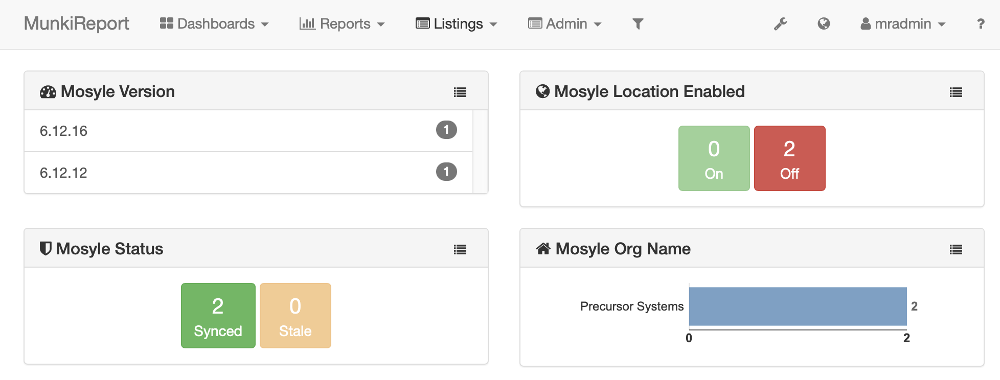

# Mosyle Business Module
A munkireport module for Mosyle Business

> v. 1.0.0 
> April 3, 2023 
> Alex Narvey / Precursor.ca  

Reports on Mosyle MDM information

Retrieves information from the preferences in the User directory at  ~/Library/Preferences/com.mosyle.macos.business.plist

The following information is stored in the table:

* Version - The Self-Service.app version
* Org Name - Name of the Organization in Mosyle MDM
* Destination - Name of destination
* Attempt Date - Timestamp of last attempt
* Success Date - Timestamp of last success
* Location Enabled - State of Location Enabled

## Notes

An output file is only created if the Self-Service.app exists in the /Applications folder.
The output file is removed if the Self-Service.app no longer exists so that new records will not be created.

## Synced
Synced refers to the last success having occurred within the last 24 hours

## Stale
Stale refers to the last success being more than 24 hours old

## Updates
* April 3, 2023 Version 1.0 

## Contributors
* Alex Narvey

—
Alex Narvey
precursor.ca
